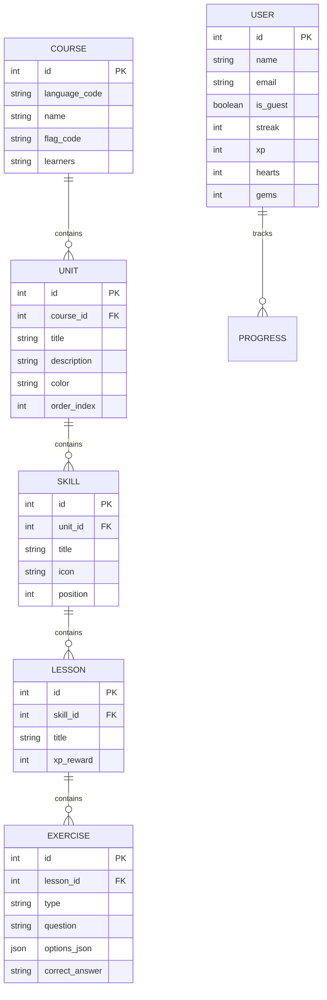

<div align="center">

# 🦉 Duolingo Clone - Full-Stack Web Application

> A pixel-perfect, production-ready full-stack **Duolingo Clone** built with **Next.js 16 (TypeScript)**, **Python (FastAPI)**, **SQLite Database**, **Web Audio API**, and **Native BCP-47 Speech Synthesis**.

[](https://nextjs.org/)
[](https://fastapi.tiangolo.com/)
[](https://www.typescriptlang.org/)
[](https://www.sqlite.org/)
[](https://tailwindcss.com/)
[](https://render.com/)
[](https://vercel.com/)
[](LICENSE)

[Live Demo](https://github.com/Shashanklko/Duolingo-Clone) • [Backend Docs](backend/README.md) • [Frontend Docs](client/README.md) • [Architecture](#-system-architecture)

---

</div>

> [!NOTE]
> Designed to replicate the exact playful, gamified, and vibrant user experience of Duolingo, featuring an interactive serpentine learning path, a 5-question multi-format exercise engine, relational database course scaffolding across 11 languages, real-time gamification stats (XP, streak, hearts, gems), and bilingual language learning.

---

## 🏆 Evaluation Matrix & Feature Completion Status

| Evaluation Criteria | Requirement | Status | Implementation Highlights |
| :--- | :--- | :---: | :--- |
| **Database Design** | Well-structured schema with proper relationships | ✅ **100%** | 5-Tier Relational SQLite schema (`backend/app/models.py`) mapping `Course` ➔ `Unit` ➔ `Skill` ➔ `Lesson` ➔ `Exercise` + `User`. |
| **Tech Stack** | Next.js (TS) + Python FastAPI + SQLite | ✅ **100%** | Next.js 16 App Router client in [`client/`](client/), Python FastAPI server in [`backend/main.py`](backend/main.py), SQLite database in `backend/duolingo.db`. |
| **Learning Path / Skill Tree** | Serpentine path with locked/unlocked progression | ✅ **100%** | S-curve unit layout with **strict sequential level locking** (`client/app/(main)/learn/page.tsx`). Locked levels require completing preceding levels. |
| **Lesson Player** | Core loop with multiple exercise types & feedback bar | ✅ **100%** | Supports MCQ with HD images, Word Bank Sentence Builder, Select Translation, Listen & Type, and Section Mastery Exam. Animated green/red feedback bar. |
| **Gamification & Progress** | Real-time XP, Streak, Hearts, Leaderboard, Shop, Quests | ✅ **100%** | Real-time XP calculation (+20 XP), +25 Gems reward, live ranked Leaderboard (`/leaderboards`), Hearts deduction/refill, Daily Quests (`/quests`). |
| **Content Management** | Relational database schema seeded with 11 language courses | ✅ **100%** | Full relational schema populated from scaffold JSON files (`backend/populate_from_scaffold.py`) for Spanish, Hindi, English, French, German, Italian, etc. |
| **Duolingo Experience & UI/UX** | Mascot flourishes, sound FX, modals, dark mode | ✅ **100%** | Duo Lottie animations, synthesized audio SFX + native BCP-47 TTS fallback (`client/lib/sounds.ts`), light & dark mode themes (`globals.css`). |

---

## 🗄️ Database Schema Design (ERD Diagram)

> [!IMPORTANT]
> The SQLite database (`backend/duolingo.db`) is architected with strict foreign key constraints and relational cascading across a 5-tier entity structure:



---

## 🏛️ System Architecture

```text
 ┌─────────────────────────────────────────────────────────────────┐
 │                      Next.js 16 Frontend                        │
 │  • React 19 App Router                                          │
 │  • TypeScript & Tailwind CSS Theme Tokens                       │
 │  • Domain-Driven Modular Components (shared, home, dashboard)   │
 │  • Web Audio API SFX & Native BCP-47 Speech Synthesis           │
 └────────────────────────────────┬────────────────────────────────┘
                                  │
                  REST API Requests (JSON & CORS)
                                  │
 ┌────────────────────────────────▼────────────────────────────────┐
 │                     FastAPI Python Backend                      │
 │  • Async FastAPI Router Controllers                             │
 │  • SQLAlchemy ORM Data Layer & Pydantic Schemas                 │
 │  • Automated Course Scaffold Ingestion Engine                   │
 └────────────────────────────────┬────────────────────────────────┘
                                  │
                       SQLite Database Engine
                                  │
 ┌────────────────────────────────▼────────────────────────────────┐
 │                      backend/duolingo.db                        │
 │        Relational Storage (Courses, Units, Exercises)           │
 └─────────────────────────────────────────────────────────────────┘
```

---

## 📁 Repository Directory Structure

```text
Duolingo-clone/
├── .github/
│   └── workflows/
│       └── deploy.yml            # Automated CI/CD GitHub Actions Pipeline
├── backend/
│   ├── app/
│   │   ├── models.py             # SQLAlchemy Relational Schema
│   │   ├── schemas.py            # Pydantic Validation Schemas
│   │   ├── database.py           # SQLite Session Engine
│   │   └── routes/               # API Controllers (units, lessons, users, courses)
│   ├── data/                     # 11 Language Scaffold Datasets (_index.json, es, hi, en, fr...)
│   ├── populate_from_scaffold.py # Data Ingestion & Exercise Generator Engine
│   ├── main.py                   # FastAPI Application Entrypoint
│   ├── Procfile                  # Render Deployment Procfile
│   └── render.yaml               # Render Service Blueprint
├── client/
│   ├── app/
│   │   ├── (main)/               # Authenticated Dashboard Layout & Pages (learn, leaderboards, shop)
│   │   ├── (marketing)/          # Landing Pages & All Courses Selector
│   │   └── lesson/[id]/          # Interactive 5-Question Lesson Engine
│   ├── components/
│   │   ├── 🌐 shared/            # Reusable UI (Navbar, Footer, Sidebar, HeaderStats, CourseDropdown)
│   │   ├── 🏠 home/              # Landing Page Sections (HeroSection, FeatureSection, LanguageRibbon)
│   │   ├── 📊 dashboard/         # Dashboard Widgets (UnitHeader, SkillNode, RightSidebar)
│   │   ├── 🎮 lesson/            # Lesson Engine Widgets (LessonHeader, LessonFooter, Exercise)
│   │   └── 🪟 modals/            # Dialog Modals (AuthModal, GuidebookModal, OutOfHeartsModal)
│   ├── contexts/
│   │   └── UserContext.tsx       # Real-Time Global Stats Context & Persistence
│   └── lib/
│       ├── sounds.ts             # Synthesized Audio SFX & Native TTS Engine
│       └── store.ts              # Zustand Store for Active & Custom Unlisted Courses
├── render.yaml                   # 1-Click Full-Stack Render Deployment Blueprint
└── README.md
```

---

## 🚀 Quick Start & Installation

### Prerequisites
- **Node.js**: `v18.0.0` or higher
- **Python**: `v3.10.0` or higher

### 1. Start Backend FastAPI Server
```bash
cd backend
python -m venv venv
# On Windows:
venv\Scripts\activate
# On macOS/Linux:
source venv/bin/activate

pip install -r requirements.txt
python populate_from_scaffold.py
python main.py
```
*FastAPI REST server will run at `http://localhost:8000` with Swagger docs at `http://localhost:8000/docs`.*

### 2. Start Frontend Next.js Server
```bash
cd client
npm install
npm run dev
```
*Next.js web application will run at `http://localhost:3000`.*

---

## 📄 Documentation Links
- 🐍 **[Backend Architecture & Database Docs](backend/README.md)**
- ⚛️ **[Frontend Architecture & Modular Component Docs](client/README.md)**

---

## 📄 License
This project is open-source and available under the **MIT License**.
