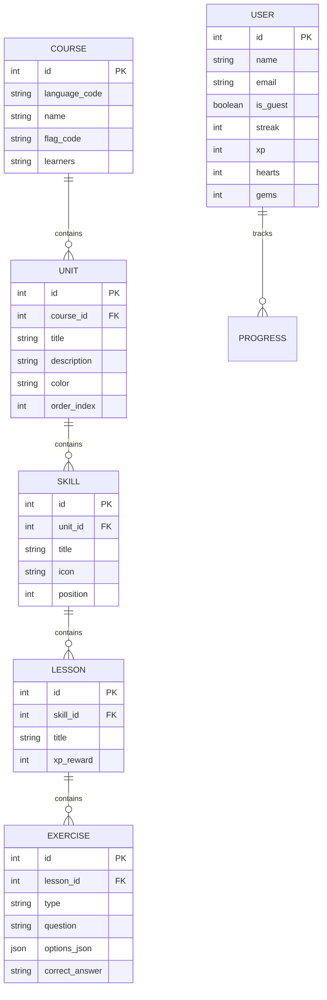

# 🐍 Backend Architecture - Duolingo Clone API & SQLite DB

FastAPI-powered Python backend providing relational course scaffolding, lesson exercise generators, user progress synchronization, and SQLite database management.

---

## 🏛️ Tech Stack & Key Dependencies

| Technology | Purpose |
| :--- | :--- |
| **Python 3.10+** | Core Runtime |
| **FastAPI** | High-performance async REST API Web Framework |
| **SQLAlchemy** | SQL ORM engine for relational data modeling |
| **Pydantic** | Data validation & API response serialization |
| **Uvicorn** | ASGI Web Server |
| **SQLite** | Embedded relational database engine (`duolingo.db`) |

---

## 🗄️ Database Schema Design (ERD Diagram)

The backend database (`backend/duolingo.db`) uses a 5-tier hierarchical structure:



---

## 🔌 API Endpoints Summary

### 1. Course Management
- **`GET /api/courses`**: Returns all available language courses (Spanish, Hindi, English, French, German, Italian, Portuguese, Japanese, Arabic, Korean, Russian).

### 2. Units & Learning Path
- **`GET /api/units?course={lang_code}`**: Fetches units, skills, position indices, and lock statuses for the requested language.

### 3. Lesson Engine & Exercises
- **`GET /api/lessons/{id}`**: Returns exercises for a specific lesson level (MCQ, Word Bank, Select Translation, Listening, Mastery Exam).

### 4. User Progress & Authentication
- **`POST /api/users/login`**: Authenticates user or registers Guest profile.
- **`POST /api/users/sync-progress`**: Real-time sync of user XP, streak, hearts, and gems.

---

## ⚙️ Data Ingestion & Seeding Engine

The backend ingests structured JSON course scaffolds from `backend/data/`:
```bash
python populate_from_scaffold.py
```
This script initializes tables, seeds vocabulary mappings for 11 languages, and generates distinct exercise types per level.

---

## 🚀 Running Backend Server

```bash
# 1. Install dependencies
pip install -r requirements.txt

# 2. Ingest course scaffold data into SQLite
python populate_from_scaffold.py

# 3. Start FastAPI Uvicorn Server
python main.py
```
*Backend runs on `http://localhost:8000` with automatic OpenAPI docs at `http://localhost:8000/docs`.*
